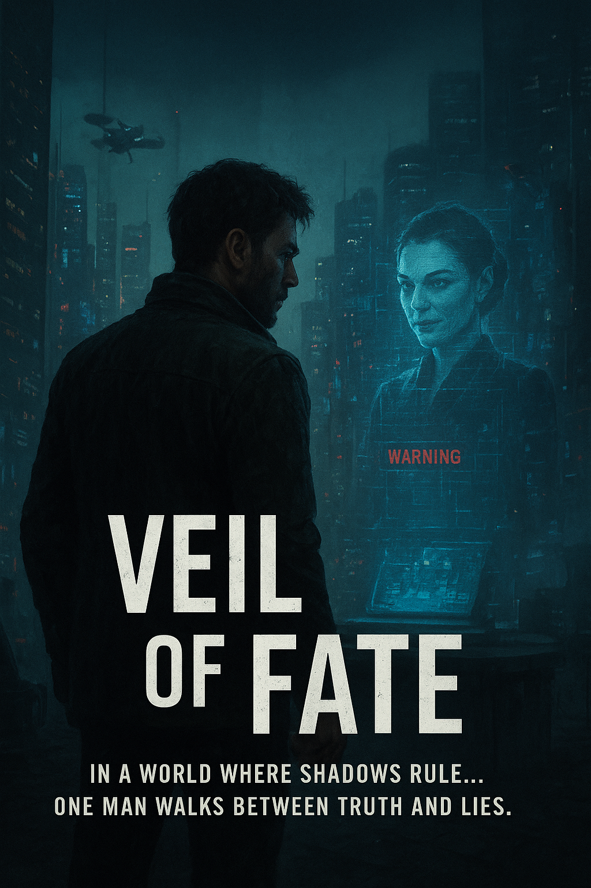
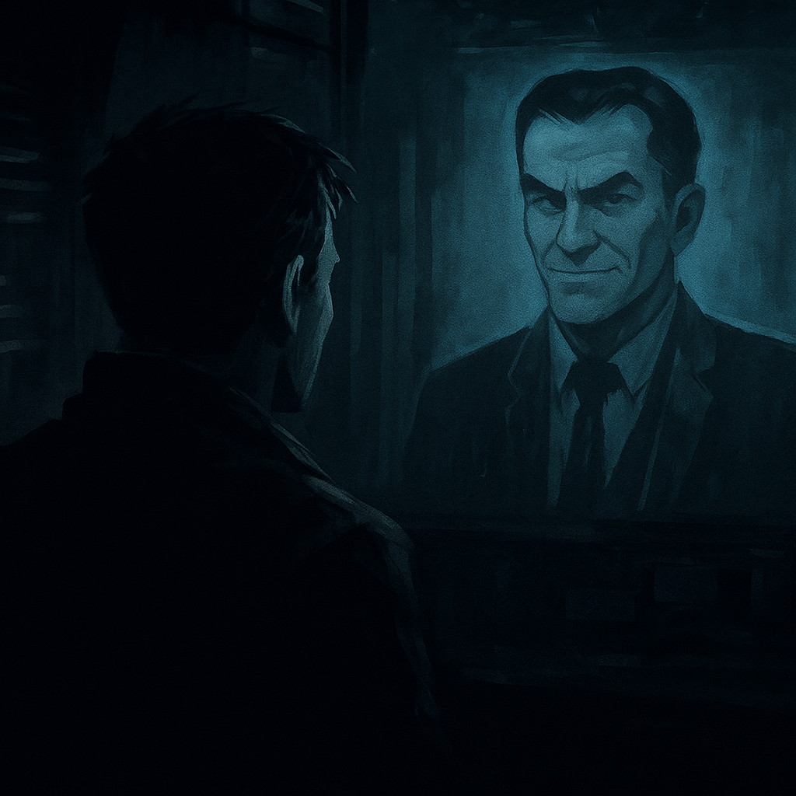
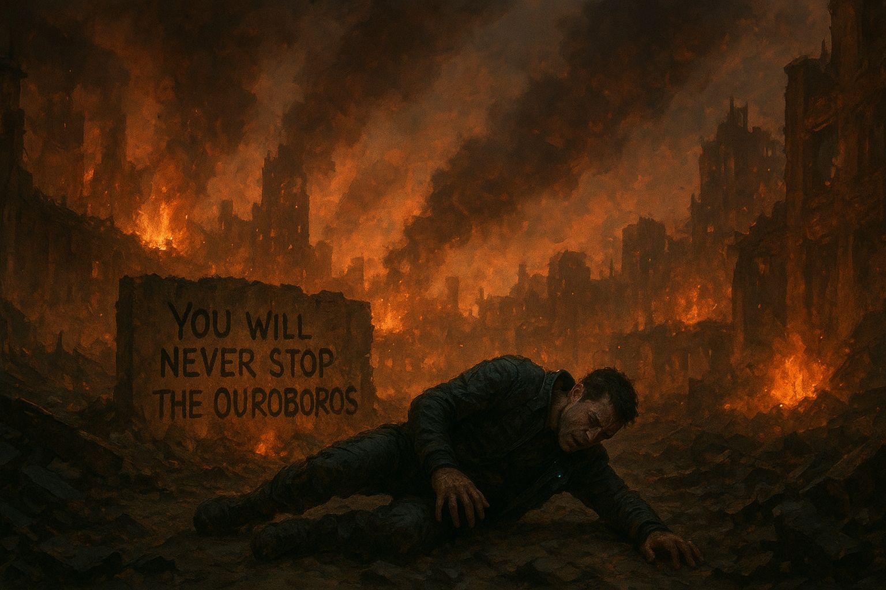
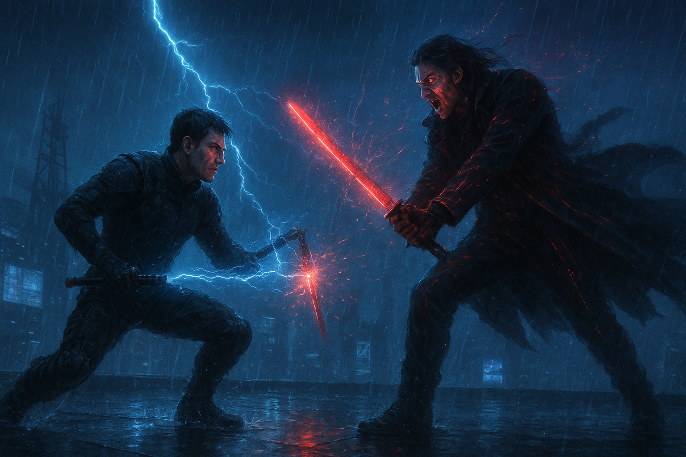

# 🎭 Veil of Fate

> *A story-driven crime thriller game that blurs the line between justice and vengeance.*

---

## 🌌 Overview

**Veil of Fate** is an original **story-based cinematic game** built in **Unity (C#)**, blending deep narrative storytelling, stylized visuals, and intense character-driven gameplay.  
The game follows a secret agent entangled in a global conspiracy — uncovering the truth behind a mysterious organization bent on reshaping the world order.

Currently, the project is in active **development**, focusing on **character sketching**, **visual tone**, and **teaser prototype design**.  

---

## 🧠 Concept & Storyline

Set in a dystopian world filled with corruption, betrayal, and hidden agendas,  
**Veil of Fate** explores the fine line between heroism and sacrifice.

The narrative follows the **Protagonist**, an undercover agent who uncovers a vast syndicate after a devastating event.  
Alongside a key supporting character, he battles not just the syndicate but his own doubts and moral conflicts — leading to an unforgettable final showdown.

> “In this world, fate isn’t written — it’s veiled.”

---

## 🧩 Technology Stack

| Tool | Purpose |
|------|----------|
| **Unity (C#)** | Core game engine for mechanics, physics, and logic |
| **Blender** | 3D modeling, environment creation, and character design |
| **Adobe Photoshop** | Texture design and environment concept art |
| **Adobe After Effects** | Cinematic cutscene creation and visual effects |
| **Visual Studio / Rider** | Scripting, debugging, and code integration |
| **Git & GitHub** | Version control and collaboration |

---

## 🎨 Development Progress

**Current Phase:** Character design & teaser visual development

✅ Character sketches and reference concepts  
✅ Environment visual direction established  
🔄 Cinematic teaser in progress  
🔜 Gameplay prototype scenes (Mission 1 – “The Infiltration”)  
🔜 Sound design and narrative cutscenes  

---

## 🖼️ Visual Development

Below are some early visual direction and mood concepts:  

| Scene Concept | Preview |
|----------------|----------|
| **preMidScene** |  |
| **midBombBlast** |  |
| **pre-Climax** |  |
| **Climax** |  |

*(All assets are original and in early development.)*

---

## 🚀 Roadmap

| Phase | Description | Status |
|--------|-------------|--------|
| **Phase 1** | Character & World Concept Development | ✅ Completed |
| **Phase 2** | Teaser Visual & Storyboard Creation | 🔄 In Progress |
| **Phase 3** | Gameplay Mechanics Prototype | ⏳ Planned |
| **Phase 4** | Alpha Build with Cutscenes | ⏳ Upcoming |

---

## 🤝 Contributions & Collaboration

Creative designers, 3D modelers, and music artists who wish to contribute are always welcome.  
If you’re interested in collaborating on this cinematic experience, please open a pull request or reach out.

---

## 📫 Full-time or Contact

**Written, Design and Developer:** Vamsi Kiran Kuchibhatla  
📍 *Boston, MA, USA*  
📧 [vamsikirankuchibhatla8093@gmail.com]  
🔗 [LinkedIn Profile](https://www.linkedin.com/in/vamsi-kiran-kuchibhatla/)  
🔗 [Portfolio Website](https://github.com/Kiran7613/game-portfolio)

---

### 🕹️ *“Every shadow hides a story — every fate hides a choice.”*
