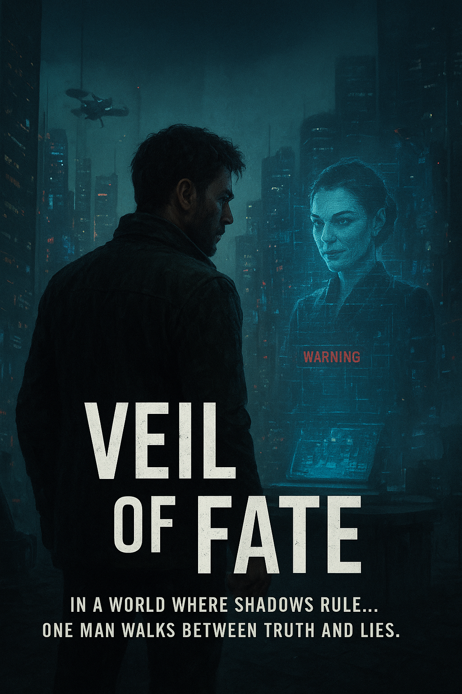
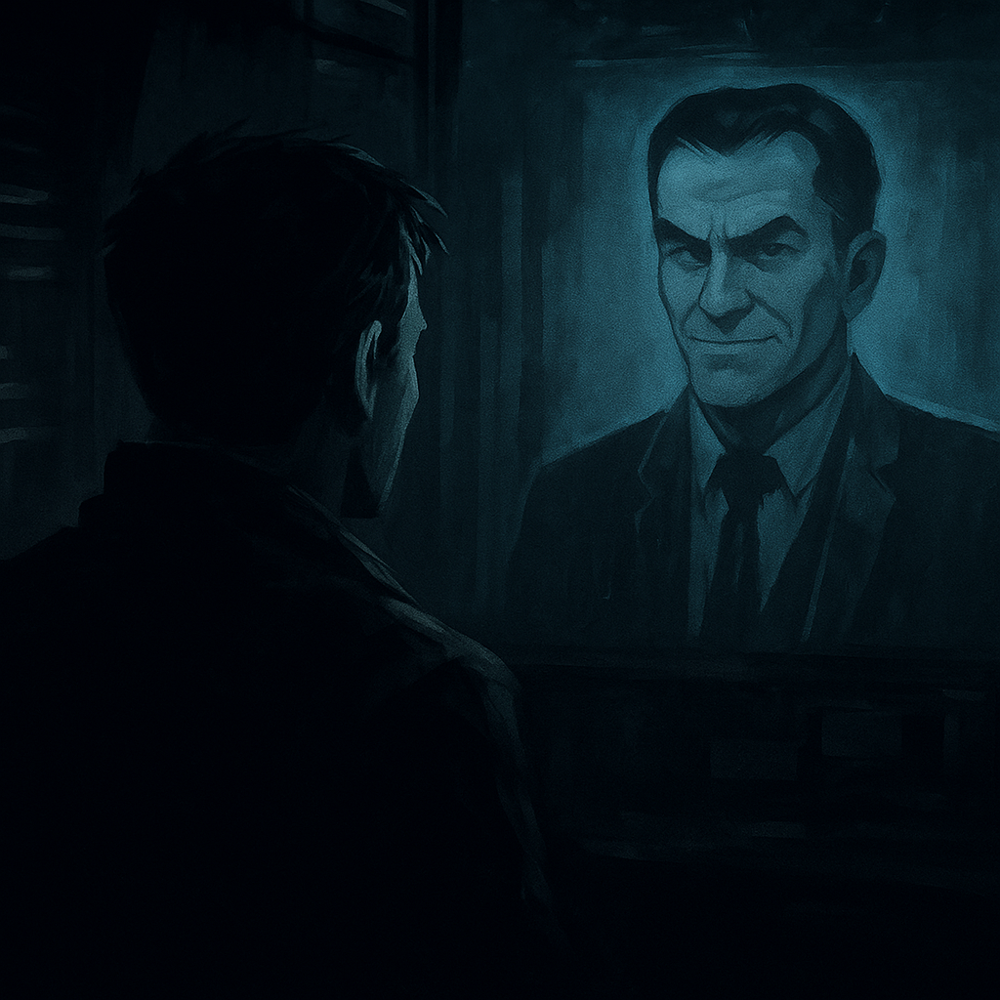
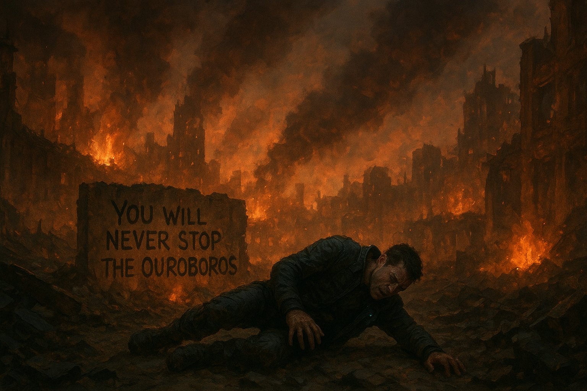
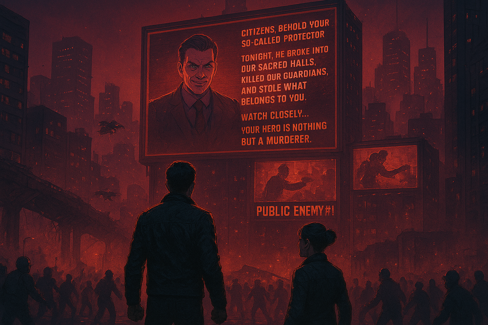
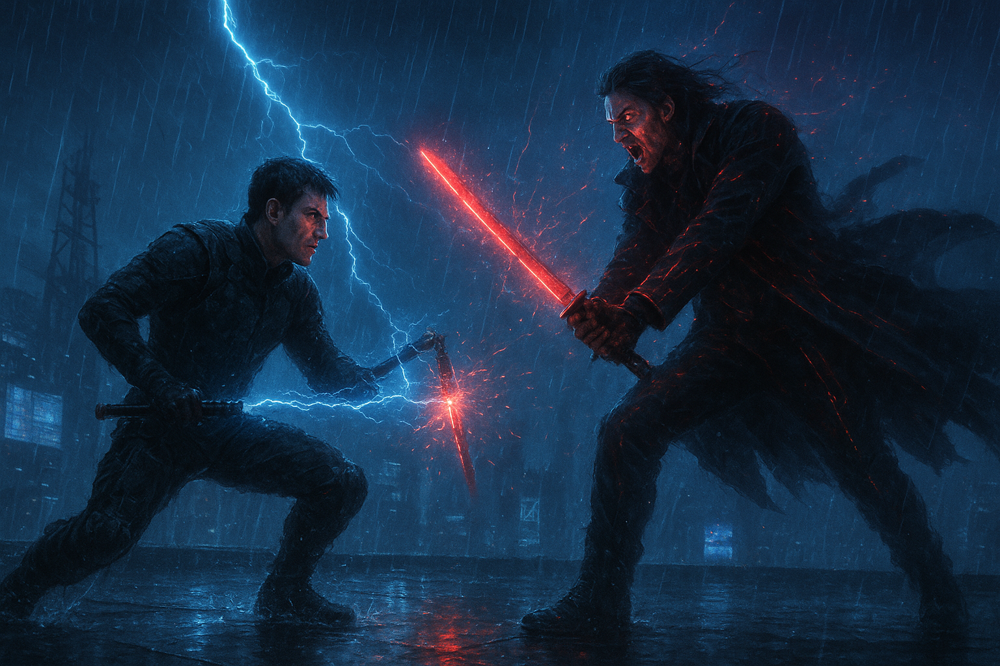

<div align="center">

# 🎭 Veil of Fate

[](https://github.com/Kiran7613/game-portfolio/releases/tag/v1.0.0)
[](https://reactjs.org/)
[](https://vitejs.dev/)
[](https://tailwindcss.com/)
[](LICENSE)
[]()



> *A story-driven crime thriller game that blurs the line between justice and vengeance.*

[🌐 Live Portfolio](#) · [📋 Roadmap](#-roadmap) · [🤝 Collaborate](#-contributions--collaboration)

</div>

---

## 🌌 Overview

**Veil of Fate** is an original **story-based cinematic game** built in **Unity (C#)**, blending deep narrative storytelling, stylized visuals, and intense character-driven gameplay.

The game follows a secret agent entangled in a global conspiracy — uncovering the truth behind a mysterious organization bent on reshaping the world order.

This repository serves as the **official portfolio site** for the project, built with **React + Vite + Tailwind CSS**.

> **Current Version:** `v1.0.0` — Character design & teaser visual phase

---

## 🧠 Concept & Storyline

Set in a dystopian world filled with corruption, betrayal, and hidden agendas, **Veil of Fate** explores the fine line between heroism and sacrifice.

The narrative follows the **Protagonist**, an undercover agent who uncovers a vast syndicate after a devastating event. Alongside a key supporting character, he battles not just the syndicate — but his own doubts and moral conflicts — leading to an unforgettable final showdown.

> *"In this world, fate isn't written — it's veiled."*

---

## 🧩 Technology Stack

### 🎮 Game Development
| Tool | Version | Purpose |
|---|---|---|
| **Unity** | 2022 LTS | Core game engine — mechanics, physics, logic |
| **C#** | 10.0 | Game scripting |
| **Blender** | 3.x | 3D modeling, environments, characters |
| **Adobe Photoshop** | CC | Texture design & concept art |
| **Adobe After Effects** | CC | Cinematic cutscenes & VFX |

### 🌐 Portfolio Site
| Tool | Version | Purpose |
|---|---|---|
| **React** | 18.2.0 | UI framework |
| **Vite** | 5.0 | Build tool & dev server |
| **Tailwind CSS** | 4.3.1 | Utility-first styling |
| **PostCSS** | 8.4 | CSS processing |

---

## 🎨 Development Progress

**Current Phase:** `v1.0.0` — Character Design & Teaser Visual Development

| Task | Status |
|---|---|
| Character sketches & reference concepts | ✅ Completed |
| Environment visual direction | ✅ Completed |
| Cinematic teaser visuals | 🔄 In Progress |
| Gameplay prototype — Mission 1: "The Infiltration" | 🔜 Planned |
| Sound design & narrative cutscenes | 🔜 Planned |

---

## 🖼️ Visual Development

Early storyboards and cinematic concept art:

| Scene | Preview |
|---|---|
| **Pre-Mid Scene** |  |
| **Mid Bomb Blast** |  |
| **Pre-Climax** |  |
| **Climax** |  |

*All assets are original and in active development.*

---

## 🚀 Roadmap

| Phase | Description | Version Target | Status |
|---|---|---|---|
| **Phase 1** | Character & World Concept Development | `v1.0.0` | ✅ Completed |
| **Phase 2** | Teaser Visual & Storyboard Creation | `v1.1.0` | 🔄 In Progress |
| **Phase 3** | Gameplay Mechanics Prototype | `v2.0.0` | ⏳ Planned |
| **Phase 4** | Alpha Build with Cutscenes | `v3.0.0` | ⏳ Upcoming |

---

## 🛠️ Running the Portfolio Site Locally

```bash
# Clone the repository
git clone https://github.com/Kiran7613/game-portfolio.git
cd game-portfolio

# Install dependencies
npm install

# Start development server
npm run dev

# Build for production
npm run build
```

---

## 🤝 Contributions & Collaboration

Creative designers, 3D modelers, and music artists who wish to contribute are always welcome. If you're interested in collaborating on this cinematic experience, please open a pull request or reach out via email.

See [CONTRIBUTING.md](CONTRIBUTING.md) for guidelines.

---

## 📫 Contact

**Written, Designed & Developed by:** Vamsi Kiran Kuchibhatla  
📍 Boston, MA, USA  
📧 vamsikirankuchibhatla8093@gmail.com  
🔗 [LinkedIn](https://www.linkedin.com/in/vamsi-kiran-kuchibhatla/)  
🔗 [Portfolio](https://github.com/Kiran7613/game-portfolio)

---

<div align="center">

### 🕹️ *"Every shadow hides a story — every fate hides a choice."*

</div>
